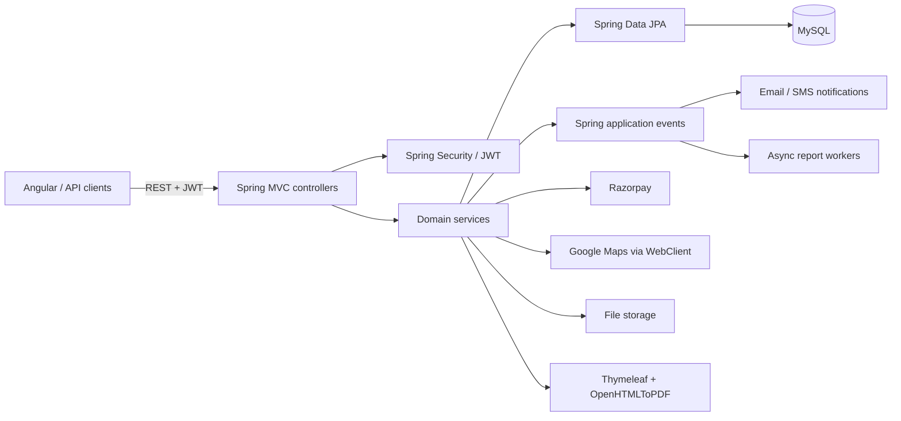

# Architecture

## 1. System shape

Fleetovo is a modular monolith. The main application is `com.core.CoreApplication`; domain behavior is organized below `com.core` into controllers, services, repositories, models, reports, data exchange, gateway, location, events/listeners, configuration and security.

## 2. Primary package responsibilities

| Package | Responsibility |
|---|---|
| `controllers` | Employee/admin REST endpoints |
| `controllers.client` | Authenticated client-app endpoints |
| `controllers.config` | Organization/billing/provider configuration |
| `controllers.vehicle` | Vehicle catalog/master/fleet endpoints |
| `services` | Core transactional use cases |
| `services.common` | Authentication, files, PDF, crypto, email and SMS helpers |
| `services.config` | Organization, billing entity, financial year and garage services |
| `services.notification` | Notification orchestration |
| `repositories` | JPA queries, org-scoped access and locks |
| `models` / `models.embedded` | Persistence model and commercial snapshots |
| `models.enums` | Persisted/domain enum contracts |
| `reports` | Report metadata, generation and storage |
| `dataexchange` | CSV metadata, validation, import/export and resource handlers |
| `gateway.razerpay` | Organization-specific Razorpay integration |
| `location` | Provider chain for distance/place/state/airport logic |
| `events` / `listeners` | Post-domain side effects and invoice/report triggers |
| `security` / `config` | JWT filter, authentication provider, method security and CORS |

## 3. Request and transaction model

1. `JwtAuthenticationFilter` resolves an optional Bearer token and loads the authenticated user.
2. Spring Security applies filter-chain rules; method-level `@PreAuthorize` adds role/authority enforcement for many employee endpoints.
3. Controllers derive organization/user context from authentication where designed and delegate to services.
4. Services perform business validation and use org-scoped repositories. Multi-step mutations are generally transactional.
5. Events decouple notification/report/invoice side effects from the initiating use case.
6. `RequestTraceFilter` creates/propagates `X-Trace-Id`; the global exception handler returns it in structured API errors.

### Important transaction boundaries

- Booking completion publishes `BookingCompletedEvent`. `BookingCompletedListener` runs **after commit** and opens a **new transaction** to create the invoice.
- Booking changes that need an already-generated invoice refreshed publish `SyncInvoiceEvent`; `SyncInvoiceListener` runs **before commit**.
- Report generation begins after commit and runs on `reportTaskExecutor`.
- Estimate payment verification deliberately separates external Razorpay verification, local settlement, and estimate-to-booking conversion so a conversion failure does not roll back an already-confirmed payment.

## 4. Concurrency strategy

Pessimistic locks are used in high-risk write paths, including bookings/duties, estimates, purchase invoices, payments, financial-year invoice counters and report state changes. Database uniqueness constraints add duplicate protection for selected provider/config/token/invoice/purchase relationships.

The architectural rule is: **do not perform avoidable network calls while holding database locks**. External verification/provider calls should be outside locked settlement phases where possible.

## 5. Persistence and schema management

- Database: MySQL.
- ORM: Hibernate through Spring Data JPA.
- Current setting: `spring.jpa.hibernate.ddl-auto=update`.
- No Flyway or Liquibase dependency is configured.
- `spring.jpa.open-in-view=true` is currently enabled.
- Auditable entities store created/updated timestamps and actors through the auditing layer.

Meaningful production schema changes therefore need an explicit deployment-safe SQL/phased plan even though Hibernate update is enabled.

## 6. Files and PDFs

`FileService` stores validated image files below the configured `filepath` using generated UUID filenames. Business entities retain filenames/references rather than binary blobs. The `/file/{filename}` route is filter-chain `permitAll`, so files served through that route must be treated as public assets.

Invoice PDFs are generated server-side from Thymeleaf templates using OpenHTMLToPDF/PDFBox. Sales invoice generation can use the selected organization billing entity's logo, terms and UPI data. ZXing is used for QR generation.

The backend image service accepts JPEG/PNG. If a frontend accepts a PDF duty slip, it must convert it to the existing image contract before upload; the backend does not persist the original PDF through `FileService`.

## 7. Async/background work

Notification listeners use Spring `@Async`. Report requests use a dedicated executor and persistent `ReportRequest` state. Recovery logic can retry stale queued/processing work up to configured attempt/time limits.

This is not a general job queue: jobs and retry state live in the application/database model and are executed by application instances.

## 8. External boundaries

Runtime adapters implemented in the backend:

- Payments: **Razorpay**; manual local payment entries also exist.
- SMS: **MSG91**.
- Email: **Zepto Mail** through the current mail service implementation.
- Geo: **Google Maps**, behind a provider chain with fallback behavior.

Persisted provider enums contain additional names, but enum presence does **not** mean a working runtime adapter exists. See [integrations.md](integrations.md).
