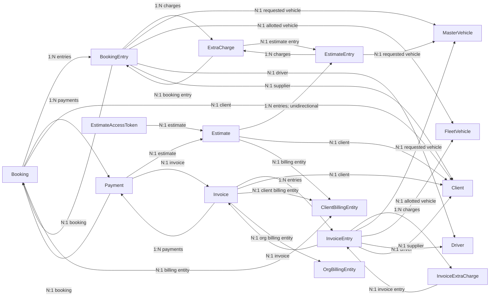
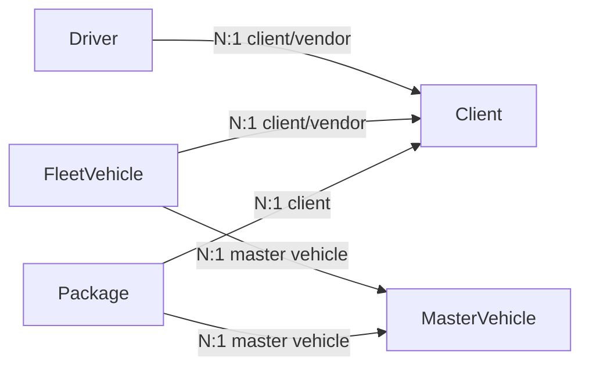
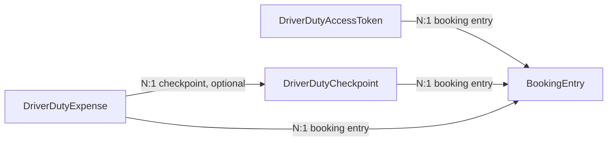
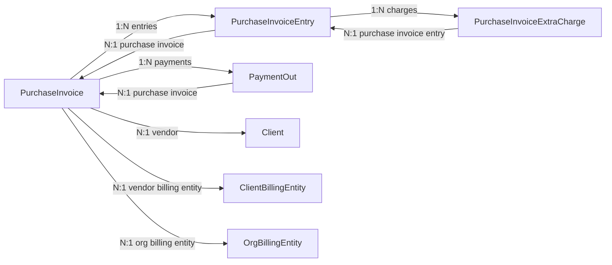

# Models and Relationships

**Scope:** persistent JPA model only. DTOs, report projections, request/response records and data-exchange metadata enums are intentionally excluded.

Fleetovo uses two different kinds of links between persistent models:

1. **JPA associations** such as `@ManyToOne` and `@OneToMany`.
2. **Application-level ID references** such as `orgId`, `userId`, `bookingId`, `bookingEntryId` and `passengerIds` where no entity association is declared.

Do not treat a scalar ID field as a JPA relationship unless the entity also declares the association.

## 1. Persistence model inventory

The persistence model contains:

- **37 `@Entity` classes**
- **6 `@Embeddable` classes**
- **1 `@MappedSuperclass`** (`AuditableEntity`)
- **40 `@ManyToOne` mappings**
- **11 `@OneToMany` mappings**
- **0 `@OneToOne` mappings**
- **0 `@ManyToMany` mappings**
- **5 `@ElementCollection` mappings**

### Organization, identity and configuration

| Model | Purpose | Important model links |
|---|---|---|
| `Org` | Organization master record | `orgId` is the unique business tenant identifier. No entity maps `Org` with a JPA association. |
| `User` | Authentication account and authorities | Scalar `orgId`; `authorities` is an element collection. No JPA link to `Employee`/`Client`. |
| `Employee` | Organization employee profile | Scalar `orgId` and `userId`; `userId` is resolved to `User` by services/repositories, not JPA. |
| `UserOtp` | OTP challenge persistence | Standalone; keyed by phone/expiry data, no JPA associations. |
| `OrgBillingEntity` | Organization legal/billing/bank/UPI/logo/terms configuration | Scalar `orgId`; referenced by invoices/purchase invoices through JPA and by financial years/reports through scalar IDs. |
| `FinancialYear` | Invoice prefix/counter date range | Scalar `orgId` and `orgBillingEntityId`; no JPA association. |
| `CityGarage` | Organization city/garage location | Scalar `orgId`; embeds `AddressSnapshot`. |
| `PaymentGatewayConfig` | Per-organization payment-gateway configuration | Scalar `orgId`; no JPA associations. |
| `EmailProviderConfig` | Per-organization email-provider configuration | Scalar `orgId`; no JPA associations. |
| `SmsProviderConfig` | Per-organization SMS-provider configuration | Scalar `orgId`; no JPA associations. |

### Parties, fleet and catalog

| Model | Purpose | Important model links |
|---|---|---|
| `Client` | Customer/vendor party record | Scalar `orgId`, optional scalar `userId`; billing entity IDs stored as an element collection. `passengers` and `clientBillingEntity` fields are transient, not persisted relationships. |
| `ClientBillingEntity` | Client/vendor legal billing identity | Scalar `orgId`; referenced from bookings, estimates, invoices and purchase invoices through JPA associations owned by those models. |
| `Passenger` | Passenger attached operationally to a client | Scalar `orgId` and `clientId`; no JPA association to `Client`. |
| `Driver` | Driver master | Scalar `orgId`; optional `@ManyToOne` to `Client` through `clientId`. |
| `MasterVehicle` | Vehicle model/catalog master | Scalar `orgId`; no outgoing JPA associations. |
| `FleetVehicle` | Physical fleet vehicle | `@ManyToOne` to `MasterVehicle` through `masterVehicleId`; optional `@ManyToOne` to `Client` through `clientId`. |
| `Package` | Commercial package/rate definition | Optional `@ManyToOne` to `Client`; `@ManyToOne` to `MasterVehicle`; embeds rate `Money` values. |

### Sales, booking and estimate

| Model | Purpose | Important model links |
|---|---|---|
| `Booking` | Booking aggregate root | Owns booking entries and booking-linked payments; links to client and client billing entity. Estimate and invoice cross-links are scalar/business identifiers. |
| `BookingEntry` | Duty/trip under a booking | Belongs to `Booking`; owns `ExtraCharge`; links to requested/master vehicle, allotted fleet vehicle, driver and supplier (`Client`). Passenger references are an ID element collection. |
| `ExtraCharge` | Extra charge used by booking or estimate entry | Nullable `@ManyToOne` to `BookingEntry` and nullable `@ManyToOne` to `EstimateEntry`. |
| `Estimate` | Quote/estimate aggregate | Unidirectional `@OneToMany` to `EstimateEntry`; links to client and client billing entity. Converted booking is stored as scalar business ID. |
| `EstimateEntry` | Estimate duty/trip snapshot | Owns estimate extra charges; links to requested `MasterVehicle`. It has no back-reference to `Estimate`. |
| `EstimateAccessToken` | Public estimate-link token | Scalar `estimateId` plus read-only `@ManyToOne` to `Estimate` using the same `estimate_id` column. |
| `Payment` | Incoming payment | Optional `@ManyToOne` links to `Booking`, `Invoice` and `Estimate`; a row can carry the applicable combination of these associations. |

### Sales invoice snapshot

| Model | Purpose | Important model links |
|---|---|---|
| `Invoice` | Sales invoice aggregate/snapshot | Owns invoice entries and invoice-linked payments; links to client, client billing entity and org billing entity. Booking is referenced by scalar business `bookingId`. |
| `InvoiceEntry` | Issued duty snapshot inside invoice | Belongs to `Invoice`; owns `InvoiceExtraCharge`; links to requested/master vehicle, allotted fleet vehicle, driver and supplier. Passenger data is stored as names, not entity references. |
| `InvoiceExtraCharge` | Issued extra-charge snapshot | Belongs to `InvoiceEntry`. |

### Driver-duty public workflow

| Model | Purpose | Important model links |
|---|---|---|
| `DriverDutyAccessToken` | Public driver-duty access token | Belongs to `BookingEntry`; also stores scalar `dutyId` and `driverId`. |
| `DriverDutyCheckpoint` | Start/end duty checkpoint | Belongs to `BookingEntry`; stores scalar booking/duty/driver/fleet identifiers and an embedded location snapshot. |
| `DriverDutyExpense` | Driver-submitted duty expense | Belongs to `BookingEntry`; optionally links to `DriverDutyCheckpoint`; also stores scalar `dutyId`. |

### Purchase and vendor accounting

| Model | Purpose | Important model links |
|---|---|---|
| `PurchaseInvoice` | Vendor purchase-invoice aggregate | Owns purchase entries and outbound payments; links to vendor (`Client`), vendor billing entity and org billing entity. |
| `PurchaseInvoiceEntry` | Snapshot of a vendor duty included in a purchase invoice | Belongs to `PurchaseInvoice`; owns `PurchaseInvoiceExtraCharge`; booking/duty/vehicle/driver/passenger links are scalar snapshots, not JPA associations. |
| `PurchaseInvoiceExtraCharge` | Purchase-side extra-charge snapshot | Belongs to `PurchaseInvoiceEntry`. |
| `PaymentOut` | Outbound vendor payment | Optional `@ManyToOne` to `PurchaseInvoice`; vendor is stored as scalar `vendorId`. |

### Reporting and utility

| Model | Purpose | Important model links |
|---|---|---|
| `ReportRequest` | Async report job state and generated-file metadata | Scalar `orgId`, `requestedBy`, `orgBillingEntityId` and generic `partyId`; no JPA associations. |
| `Document` | Generic document/file metadata | Scalar `orgId` and generic `referenceId`; no JPA associations. |
| `Reminder` | Generic reminder metadata | Scalar `orgId` and generic `referenceId`; no JPA associations. |

## 2. Actual JPA entity-association diagrams

The diagrams below show **only entity associations declared with JPA relationship annotations**. Scalar IDs are intentionally excluded here and documented later.

### Booking, estimate, invoice and incoming payment



### Fleet and catalog



All of the client/vendor links above are optional at the Java mapping level unless another validation/service rule makes them mandatory for a specific workflow.

### Driver-duty submissions



### Purchase invoices and outbound payments



## 3. Complete JPA association inventory

### `@ManyToOne` — 40 mappings

| Owning model.field | Target | Join column | Notes |
|---|---|---|---|
| `Booking.client` | `Client` | `clientId` | Read-only association over scalar ID (`insertable=false`, `updatable=false`). |
| `Booking.clientBillingEntity` | `ClientBillingEntity` | `clientBillingEntityId` | Read-only association over scalar ID. |
| `BookingEntry.booking` | `Booking` | `booking_id` | Required; owning side of booking-entry aggregate. |
| `BookingEntry.requestedVehicle` | `MasterVehicle` | `masterVehicleId` | Read-only association over scalar ID. |
| `BookingEntry.allotedVehicle` | `FleetVehicle` | `fleetVehicleId` | Read-only association over scalar ID. |
| `BookingEntry.driver` | `Driver` | `driverId` | Read-only association over scalar ID. |
| `BookingEntry.supplier` | `Client` | `supplierId` | Read-only association; supplier/vendor is represented by `Client`. |
| `Driver.client` | `Client` | `clientId` | Read-only association over scalar ID. |
| `DriverDutyAccessToken.bookingEntry` | `BookingEntry` | `booking_entry_id` | Required. |
| `DriverDutyCheckpoint.bookingEntry` | `BookingEntry` | `booking_entry_id` | Required. |
| `DriverDutyExpense.bookingEntry` | `BookingEntry` | `booking_entry_id` | Required. |
| `DriverDutyExpense.checkpoint` | `DriverDutyCheckpoint` | `checkpoint_id` | Optional. |
| `Estimate.client` | `Client` | `clientId` | Read-only association over scalar ID. |
| `Estimate.clientBillingEntity` | `ClientBillingEntity` | `clientBillingEntityId` | Read-only association over scalar ID. |
| `EstimateAccessToken.estimate` | `Estimate` | `estimate_id` | Read-only association over scalar `estimateId`; this scalar stores `Estimate.id`, not the human/business `Estimate.estimateId`. |
| `EstimateEntry.requestedVehicle` | `MasterVehicle` | `masterVehicleId` | Read-only association over scalar ID. |
| `ExtraCharge.bookingEntry` | `BookingEntry` | `booking_entry_id` | Nullable mapping. |
| `ExtraCharge.estimateEntry` | `EstimateEntry` | `estimate_entry_id` | Nullable mapping. |
| `FleetVehicle.masterVehicle` | `MasterVehicle` | `masterVehicleId` | Read-only association over scalar ID. |
| `FleetVehicle.client` | `Client` | `clientId` | Read-only association over scalar ID. |
| `Invoice.client` | `Client` | `clientId` | Read-only association over scalar ID. |
| `Invoice.clientBillingEntity` | `ClientBillingEntity` | `clientBillingEntityId` | Read-only association over scalar ID. |
| `Invoice.orgBillingEntity` | `OrgBillingEntity` | `orgBillingEntityId` | Read-only association over scalar ID. |
| `InvoiceEntry.invoice` | `Invoice` | `invoice_id` | Required. |
| `InvoiceEntry.requestedVehicle` | `MasterVehicle` | `masterVehicleId` | Read-only association over scalar ID. |
| `InvoiceEntry.allotedVehicle` | `FleetVehicle` | `fleetVehicleId` | Read-only association over scalar ID. |
| `InvoiceEntry.driver` | `Driver` | `driverId` | Read-only association over scalar ID. |
| `InvoiceEntry.supplier` | `Client` | `supplierId` | Read-only association over scalar ID. |
| `InvoiceExtraCharge.invoiceEntry` | `InvoiceEntry` | `invoice_entry_id` | Required. |
| `Package.client` | `Client` | `clientId` | Read-only association over scalar ID. |
| `Package.masterVehicle` | `MasterVehicle` | `masterVehicleId` | Read-only association over scalar ID. |
| `Payment.booking` | `Booking` | `booking_id` | Optional. |
| `Payment.invoice` | `Invoice` | `invoice_id` | Optional. |
| `Payment.estimate` | `Estimate` | `estimate_id` | Optional. |
| `PaymentOut.purchaseInvoice` | `PurchaseInvoice` | `purchase_invoice_id` | Optional at mapping level. |
| `PurchaseInvoice.vendor` | `Client` | `vendorId` | Read-only association; vendor is represented by `Client`. |
| `PurchaseInvoice.vendorBillingEntity` | `ClientBillingEntity` | `vendorBillingEntityId` | Read-only association. |
| `PurchaseInvoice.orgBillingEntity` | `OrgBillingEntity` | `orgBillingEntityId` | Read-only association. |
| `PurchaseInvoiceEntry.purchaseInvoice` | `PurchaseInvoice` | `purchase_invoice_id` | Required. |
| `PurchaseInvoiceExtraCharge.purchaseInvoiceEntry` | `PurchaseInvoiceEntry` | `purchase_invoice_entry_id` | Required. |

### `@OneToMany` — 11 mappings

| Parent model.field | Child | Mapping behavior |
|---|---|---|
| `Booking.entries` | `BookingEntry` | `mappedBy=booking`, cascade all, orphan removal. |
| `Booking.payments` | `Payment` | `mappedBy=booking`, cascade all, orphan removal. |
| `BookingEntry.charges` | `ExtraCharge` | `mappedBy=bookingEntry`, cascade all, orphan removal. |
| `Estimate.entries` | `EstimateEntry` | **Unidirectional** one-to-many; cascade all, orphan removal, eager fetch; there is no `EstimateEntry.estimate` field. |
| `EstimateEntry.charges` | `ExtraCharge` | `mappedBy=estimateEntry`, cascade all, orphan removal. |
| `Invoice.entries` | `InvoiceEntry` | `mappedBy=invoice`, cascade all, orphan removal, lazy fetch. |
| `Invoice.payments` | `Payment` | `mappedBy=invoice`, cascade all, orphan removal, lazy fetch. |
| `InvoiceEntry.charges` | `InvoiceExtraCharge` | `mappedBy=invoiceEntry`, cascade all, orphan removal. |
| `PurchaseInvoice.entries` | `PurchaseInvoiceEntry` | `mappedBy=purchaseInvoice`, cascade all, orphan removal, lazy fetch. |
| `PurchaseInvoice.payments` | `PaymentOut` | `mappedBy=purchaseInvoice`, cascade all, orphan removal, lazy fetch. |
| `PurchaseInvoiceEntry.charges` | `PurchaseInvoiceExtraCharge` | `mappedBy=purchaseInvoiceEntry`, cascade all, orphan removal. |

There are no `@OneToOne` or `@ManyToMany` mappings in the current model package.

## 4. Element collections — not entity relationships

| Owner.field | Collection table | Stored value | Meaning |
|---|---|---|---|
| `User.authorities` | `user_authorities` | `Authority` enum string | Security authorities. |
| `Client.clientBillingEntityIds` | `client_billing_entities` | billing-entity ID string | Application-level references to `ClientBillingEntity`; not `@ManyToMany`. |
| `BookingEntry.passengerIds` | `booking_entry_passengers` | passenger ID string | Application-level passenger references; not an entity collection. |
| `InvoiceEntry.passengerNames` | `invoice_entry_passengers` | passenger name string | Issued snapshot text; deliberately not a `Passenger` relation. |
| `PurchaseInvoiceEntry.passengerIds` | `purchase_invoice_entry_passengers` | passenger ID string | Snapshot/application references; not an entity collection. |

## 5. Important scalar/application relationships

These links are meaningful in services/repositories but **are not JPA entity associations**.

### Tenant ownership

`Org.orgId` is a unique business tenant identifier. Organization-owned records generally store it as a scalar `orgId` instead of a foreign-key entity association.

Direct `orgId` fields are present on:

`Booking`, `CityGarage`, `Client`, `ClientBillingEntity`, `Document`, `Driver`, `DriverDutyAccessToken`, `DriverDutyCheckpoint`, `DriverDutyExpense`, `EmailProviderConfig`, `Employee`, `Estimate`, `EstimateAccessToken`, `FinancialYear`, `FleetVehicle`, `Invoice`, `MasterVehicle`, `OrgBillingEntity`, `Package`, `Passenger`, `Payment`, `PaymentGatewayConfig`, `PaymentOut`, `PurchaseInvoice`, `PurchaseInvoiceEntry`, `Reminder`, `ReportRequest`, `SmsProviderConfig`, and `User`.

Child/snapshot entities such as `BookingEntry`, `EstimateEntry`, `ExtraCharge`, `InvoiceEntry`, `InvoiceExtraCharge` and `PurchaseInvoiceExtraCharge` obtain ownership through their parent aggregate instead of storing a direct `orgId`.

### Identity/profile links

| Source | Scalar reference | Target/meaning |
|---|---|---|
| `Employee.userId` | `User.id` | Employee authentication account; resolved in repository/service code. |
| `Client.userId` | `User.id` | Optional client authentication account. |
| `User.orgId` | `Org.orgId` | Tenant membership; not an entity association. |

### Client/passenger/billing links

| Source | Scalar reference | Target/meaning |
|---|---|---|
| `Client.clientBillingEntityIds[]` | `ClientBillingEntity.id` | Stored in element collection. |
| `Passenger.clientId` | `Client.id` | Passenger ownership; repository lookup rather than JPA association. |
| `BookingEntry.passengerIds[]` | `Passenger.id` | Selected passengers for a duty; stored as strings. |
| `PurchaseInvoiceEntry.passengerIds[]` | `Passenger.id` values copied into purchase snapshot | No JPA relation. |

`Client.clientBillingEntity` and `Client.passengers` are Java `transient` fields populated by service code and must not be interpreted as persisted JPA relationships.

### Estimate → booking conversion links

| Source | Scalar reference | Meaning |
|---|---|---|
| `Booking.sourceEstimateId` | `Estimate.estimateId` | Stores the **business estimate number/ID**, not `Estimate.id`. |
| `Estimate.convertedBookingId` | `Booking.bookingId` | Stores the **business booking ID**, not `Booking.id`. |
| `EstimateAccessToken.estimateId` | `Estimate.id` | Persistence ID used by the token association; different semantics from `Estimate.estimateId`. |

### Booking → invoice links

| Source | Scalar reference | Meaning |
|---|---|---|
| `Invoice.bookingId` | `Booking.bookingId` | Business booking ID; enforced as unique per organization by `uk_invoice_org_booking`. |
| `Booking.invoiceNumber` | `Invoice.invoiceNumber` | Business invoice-number cross-reference written when an invoice is created. |

There is no `Invoice.booking` or `Booking.invoice` JPA association.

### Financial-year/billing links

| Source | Scalar reference | Meaning |
|---|---|---|
| `FinancialYear.orgBillingEntityId` | `OrgBillingEntity.id` | Billing entity whose invoice prefix/counter is being managed. |
| `ReportRequest.orgBillingEntityId` | `OrgBillingEntity.id` when supplied | Report filter/context; no JPA association. |

### Driver-duty scalar snapshots

| Source | Scalar fields | Meaning |
|---|---|---|
| `DriverDutyAccessToken` | `dutyId`, `driverId` | Duty business ID and driver ID retained alongside the required `BookingEntry` association. |
| `DriverDutyCheckpoint` | `bookingId`, `dutyId`, `driverId`, `fleetVehicleId` | Operational identifiers captured with the checkpoint; authoritative aggregate relation is `bookingEntry`. |
| `DriverDutyExpense` | `dutyId` | Duty business ID retained alongside `bookingEntry`; optional checkpoint association is separate. |

### Purchase-invoice duty snapshot links

`PurchaseInvoiceEntry` intentionally does not map live booking/duty/fleet entities with JPA associations. It stores the source identifiers as snapshot/reference fields:

| Field | Source meaning |
|---|---|
| `vendorId` | `Client.id` of supplier/vendor |
| `bookingId` | `Booking.bookingId` business ID |
| `bookingEntryId` | `BookingEntry.id` persistence ID |
| `activeBookingEntryId` | Copy of `bookingEntryId` while the duty is actively locked into a purchase invoice; unique constraint prevents duplicate active inclusion |
| `dutyId` | `BookingEntry.dutyId` business ID |
| `masterVehicleId` | `MasterVehicle.id` |
| `supplierId` | `Client.id` supplier/vendor reference |
| `fleetVehicleId` | `FleetVehicle.id` |
| `driverId` | `Driver.id` |
| `passengerIds[]` | Passenger ID strings |

The only entity associations on `PurchaseInvoiceEntry` are `purchaseInvoice` and its child `charges` collection.

### Generic references

- `Document.referenceId` is generic and does not point to one fixed entity type in the JPA model.
- `Reminder.referenceId` is generic and does not point to one fixed entity type in the JPA model.
- `ReportRequest.partyId` is interpreted together with `partyType`; it is not a JPA association.
- `ReportRequest.requestedBy` is an actor identifier persisted as text; the model does not declare a `User` association.
- `Payment.collectionContext` + `collectionContextId` are provider/workflow context fields, not JPA entity associations.
- Razorpay/provider identifiers on `Payment` (`gatewayOrderId`, `gatewayPaymentId`, `gatewayQrCodeId`) are external provider IDs, not Fleetovo model relationships.

## 6. Embedded and inherited model types

### `AuditableEntity` — mapped superclass

Adds `createdAt`, `updatedAt`, `createdBy` and `updatedBy` to the 31 entities that extend it. It is not an entity/table by itself.

### Embeddables

| Embedded type | Used for | Main owners |
|---|---|---|
| `DisplayAddress` | Display/postal address | `Org`, `OrgBillingEntity`, `Client`, `ClientBillingEntity`, `Driver`, `Employee` |
| `Name` | Structured person name | `Client`, `Driver` (name + father name), `Employee`, `Passenger` |
| `AddressSnapshot` | Operational/geocoded location snapshot | `BookingEntry`, `EstimateEntry`, `InvoiceEntry`, `PurchaseInvoiceEntry`, `CityGarage`, `FleetVehicle`, `DriverDutyCheckpoint` |
| `Money` | Amount + currency | Commercial, payment, charge and invoice models; also nested inside `PackageSnapshot` |
| `GstSnapshot` | GST type/rate/component amounts | `Booking`, `Estimate`, `Invoice`, `PurchaseInvoice` |
| `PackageSnapshot` | Historical package/commercial snapshot | `BookingEntry`, `EstimateEntry`, `InvoiceEntry`, `PurchaseInvoiceEntry` |

`PackageSnapshot.packageId` is explicitly a reference-only scalar field and is not FK/JPA relationship logic.

## 7. Relationship rules that matter during changes

1. **Do not invent an `Org` entity association.** The current tenancy model is scalar `orgId` plus org-scoped repository/service validation.
2. **Do not convert ID element collections to entity relations casually.** Client billing IDs and duty/passenger IDs are part of the current persistence contract.
3. **Preserve snapshot boundaries.** `InvoiceEntry` and `PurchaseInvoiceEntry` intentionally carry copied commercial/operational values rather than live aggregate relationships for every source model.
4. **Do not confuse business IDs and persistence IDs.** `Booking.bookingId`, `Booking.id`, `Estimate.estimateId`, `Estimate.id`, `BookingEntry.dutyId` and `BookingEntry.id` have different roles.
5. **Respect read-only associations over scalar columns.** Many master-data associations use `insertable=false, updatable=false`; persistence is controlled by the scalar ID field.
6. **Estimate entries are special.** `Estimate.entries` is a unidirectional one-to-many; do not assume an `EstimateEntry.estimate` back-reference exists.
7. **Payment can link to multiple commercial aggregates.** Its booking/invoice/estimate relations are all optional mappings; workflow validation determines the valid combination.
8. **Purchase duty duplicate protection is scalar/constraint-based.** `activeBookingEntryId` is the current duplicate-lock mechanism, not a JPA relationship.

## 8. Source locations

Primary source package:

```text
src/main/java/com/core/models/
src/main/java/com/core/models/embedded/
src/main/java/com/core/models/enums/
```

For query/ownership behavior, inspect the corresponding repositories and services before changing a relationship. The annotations describe persistence shape; service-level organization and lifecycle validation remains authoritative.
